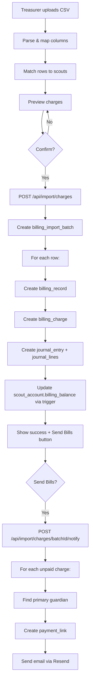

# Billing Charge CSV Import Implementation Plan

> **Status:** Completed
> **Created:** 2026-03-25
> **Author:** Claude

---

## 1. Requirements

### 1.1 Problem Statement

Treasurers need to bill scouts for events (summer camp, campouts, equipment) where each scout may owe a different amount. Today, there's no way to bulk-create billing charges from a spreadsheet — charges must be created one at a time. Treasurers already have this data in spreadsheets from camp registrations, event sign-ups, etc.

### 1.2 User Stories

- [ ] As a **treasurer**, I want to upload a CSV of charges (e.g., summer camp fees per scout) so that billing records are created for each scout's account
- [ ] As a **treasurer**, I want to review the imported charges before sending notifications so that I can catch errors before parents see them
- [ ] As a **treasurer**, I want to send billing notifications to all families with one click so that parents receive payment links
- [ ] As a **treasurer**, I want to see which scouts have paid and which still owe for each billing item so that I can follow up on outstanding charges
- [ ] As a **parent**, I want to receive an email with a payment link when my scout is charged so that I can pay online or know what I owe

### 1.3 Acceptance Criteria

- [ ] Treasurer can upload a CSV with scout names and amounts
- [ ] System auto-maps columns with fallback to manual mapping
- [ ] System matches CSV rows to scouts (BSA ID → name match → manual)
- [ ] Each CSV row creates a `billing_record` + `billing_charge` with proper double-entry accounting
- [ ] After import, treasurer sees confirmation with "Send Bills" button
- [ ] "Send Bills" triggers payment link emails to guardians (uses existing notification system)
- [ ] Finances overview "Who Owes Money" card shows per-billing-record breakdown with paid/unpaid status
- [ ] Individual scout account pages show billing charges in transaction history
- [ ] Build and all tests pass

### 1.4 Out of Scope

- Recurring/scheduled billing (future feature)
- In-app "I'll pay by check" acknowledgment from parents
- Editing charges after import (void and re-import instead)
- Multi-unit billing (each upload is for one unit)
- AI receipt scanning / OCR for charge extraction

### 1.5 Open Questions

| Question | Answer | Decided By |
|----------|--------|------------|
| One billing_record per upload or per row? | **Per row** — each CSV row creates its own billing_record + billing_charge | User |
| Where does outstanding bills view live? | **Finances overview** — enhance the "Who Owes Money" card | User |
| Auto-notify or review-then-notify? | **Review then notify** — show confirmation, treasurer clicks "Send Bills" | User |
| Uniform or variable amounts? | **Variable per row** — each row has scout name + amount | User |

---

## 2. Technical Design

### 2.1 Approach

Mirror the existing balance import wizard pattern (upload → map columns → preview matches → confirm) but create `billing_records` + `billing_charges` instead of adjusting balances. Leverage existing infrastructure:

- **CSV parsing**: New parser modeled on `balance-csv-parser.ts`
- **Scout matching**: Reuse the 3-tier matching logic (BSA ID → name → manual)
- **Accounting**: Create journal entries (debit receivables, credit revenue/liability)
- **Notifications**: Reuse existing `/api/billing-records/[id]/notify` endpoint
- **Payment**: Existing payment link system handles Square + Scout Funds

**Key design decision**: Each CSV row creates its own `billing_record` (not one record per upload). This gives each charge its own description, date, and independent notification/payment lifecycle. The import creates a `billing_import_batch` to group them for undo capability.

### 2.2 Database Changes

```sql
-- Migration: billing_import_batches table (for undo/tracking)
CREATE TABLE IF NOT EXISTS billing_import_batches (
    id UUID PRIMARY KEY DEFAULT gen_random_uuid(),
    unit_id UUID NOT NULL REFERENCES units(id) ON DELETE CASCADE,
    created_by UUID NOT NULL REFERENCES profiles(id),
    filename TEXT,
    total_records INTEGER NOT NULL DEFAULT 0,
    total_amount DECIMAL(10,2) NOT NULL DEFAULT 0,
    notifications_sent BOOLEAN DEFAULT FALSE,
    created_at TIMESTAMPTZ NOT NULL DEFAULT NOW()
);

-- Add batch reference to billing_records
ALTER TABLE billing_records ADD COLUMN IF NOT EXISTS billing_import_batch_id UUID REFERENCES billing_import_batches(id);
```

### 2.3 API/Server Actions

| Endpoint | Method | Purpose |
|----------|--------|---------|
| `/api/import/charges` | POST | Process CSV import → create billing_records + charges + journal entries |
| `/api/import/charges/[batchId]/notify` | POST | Send notifications for all unpaid charges in a batch |

### 2.4 UI Components

| Component | Location | Purpose |
|-----------|----------|---------|
| `ChargeImportWizard` | `src/components/import/charge-import-wizard.tsx` | 4-step wizard: upload → map → preview → confirm |
| `ChargeUpload` | `src/components/import/charge-upload.tsx` | CSV file upload with drag-drop |
| `ChargeColumnMapper` | `src/components/import/charge-column-mapper.tsx` | Map CSV columns to fields |
| `ChargePreview` | `src/components/import/charge-preview.tsx` | Preview matched charges, manual scout matching |
| `ChargeImportComplete` | `src/components/import/charge-import-complete.tsx` | Success screen with "Send Bills" button |
| `OutstandingBillsCard` | `src/components/finances/outstanding-bills-card.tsx` | Enhanced "Who Owes Money" with per-record drill-down |

### 2.5 Architecture Diagram



### 2.6 CSV Template

**Provided template** (`billing-charges-template.csv`):
```csv
First Name,Last Name,Amount,Description,Date,Reference,Memo
John,Smith,350.00,Summer Camp 2026,2026-06-15,INV-2026-001,Standard registration
Jane,Doe,275.00,Summer Camp 2026,2026-06-15,INV-2026-001,Early bird discount applied
```

**Flexible column detection** (auto-maps these patterns):

| Field | Required? | Maps to | Auto-detect patterns |
|-------|-----------|---------|---------------------|
| First Name | Yes (or Full Name) | Scout matching | `first name`, `first`, `given name` |
| Last Name | Yes (or Full Name) | Scout matching | `last name`, `last`, `surname`, `family name` |
| Full Name | Yes (or First+Last) | Scout matching | `name`, `scout name`, `full name`, `scout` |
| Amount | Yes | `billing_charges.amount`, `billing_records.total_amount` | `amount`, `charge`, `fee`, `cost`, `price`, `total`, `dues` |
| Description | Optional* | `billing_records.description`, `journal_entries.description` | `description`, `reason`, `item`, `event` |
| Date | Optional* | `billing_records.billing_date`, `journal_entries.entry_date` | `date`, `billing date`, `charge date`, `due date` |
| Reference | Optional | `journal_entries.reference` (e.g., invoice number, PO) | `reference`, `ref`, `invoice`, `invoice number`, `po`, `po number` |
| Memo | Optional | `journal_lines.memo` (per-scout note on the charge) | `memo`, `note`, `notes`, `comment` |
| BSA ID | Optional | Scout matching (alternate identifier) | `bsa id`, `member id`, `bsa number`, `bsa member id` |

*If description or date columns are missing from CSV, prompt the treasurer to enter them once (applies to all rows).

---

## 3. Implementation Tasks

### Phase 0: Foundation

#### 0.1 Database Setup
- [x] **0.1.1** Create migration for `billing_import_batches` table and `billing_records.billing_import_batch_id` column
  - Files: `supabase/migrations/YYYYMMDD_billing_import_batches.sql`
  - Test: Migration applies, table exists, column added

#### 0.2 CSV Parser
- [x] **0.2.1** Create charge CSV parser with auto-detection
  - Files: `src/lib/import/charge-csv-parser.ts`
  - Test: Unit tests for column detection, amount parsing, date parsing, edge cases (empty rows, missing fields)

---

### Phase 1: Import Wizard

#### 1.1 Upload Step
- [x] **1.1.1** Create `ChargeUpload` component (drag-drop CSV upload)
  - Files: `src/components/import/charge-upload.tsx`
  - Test: Renders file input, validates .csv extension, calls parser

#### 1.2 Column Mapping Step
- [x] **1.2.1** Create `ChargeColumnMapper` component
  - Files: `src/components/import/charge-column-mapper.tsx`
  - Test: Shows auto-detected mappings, allows override, validates required fields (name + amount)

#### 1.3 Preview Step
- [x] **1.3.1** Create `ChargePreview` component with scout matching
  - Files: `src/components/import/charge-preview.tsx`
  - Test: Matches scouts by name, shows unmatched rows with manual select, displays charge summary

#### 1.4 Import API
- [x] **1.4.1** Create `/api/import/charges` endpoint
  - Files: `src/app/api/import/charges/route.ts`
  - Test: Creates billing_records, billing_charges, journal_entries; updates scout balances; returns batch ID

#### 1.5 Complete Step
- [x] **1.5.1** Create `ChargeImportComplete` component with "Send Bills" button
  - Files: `src/components/import/charge-import-complete.tsx`
  - Test: Shows import results, "Send Bills" triggers batch notification

#### 1.6 Wizard Orchestration
- [x] **1.6.1** Create `ChargeImportWizard` to orchestrate all steps
  - Files: `src/components/import/charge-import-wizard.tsx`
  - Test: Steps flow correctly, state preserved between steps

#### 1.7 Import Page
- [x] **1.7.1** Create settings import page at `/settings/import/charges`
  - Files: `src/app/(dashboard)/settings/import/charges/page.tsx`
  - Test: Page loads for admin/treasurer, redirects others

---

### Phase 2: Batch Notifications

#### 2.1 Notification API
- [x] **2.1.1** Create `/api/import/charges/[batchId]/notify` endpoint
  - Files: `src/app/api/import/charges/[batchId]/notify/route.ts`
  - Test: Sends emails to guardians for all unpaid charges in batch, creates payment links

---

### Phase 3: Outstanding Bills View

#### 3.1 Enhanced Overview Card
- [x] **3.1.1** Create `OutstandingBillsCard` component
  - Files: `src/components/finances/outstanding-bills-card.tsx`
  - Test: Shows billing records with paid/unpaid counts, expandable to see per-scout status

- [x] **3.1.2** Replace "Who Owes Money" card on finances overview
  - Files: `src/app/(dashboard)/finances/page.tsx`
  - Test: New card renders with billing record data, links to scout accounts

- [x] **3.1.3** Query billing data for the overview page
  - Files: `src/app/(dashboard)/finances/page.tsx`
  - Test: Fetches recent billing_records with charge counts (paid vs unpaid) and totals

---

<!-- MVP BOUNDARY - Everything above is required for MVP -->

### Phase 4: Enhancements (Post-MVP)

#### 4.1 Import Entry Point
- [x] **4.1.1** Add "Import Charges" button to QuickActionsCard on finances overview
  - Files: `src/components/finances/quick-actions-card.tsx`
  - Test: Button visible for admin/treasurer, links to import page

#### 4.2 Undo Support
- [x] **4.2.1** Add ability to void all charges in an import batch
  - Files: `src/app/api/import/charges/[batchId]/void/route.ts`
  - Test: Voids all billing_records and charges in batch, creates reversal journal entries

#### 4.3 CSV Template Download
- [x] **4.3.1** Add downloadable template CSV pre-populated with current scout names
  - Files: `src/app/api/import/charges/template/route.ts`
  - Test: Returns CSV with all active scout names, empty amount/description columns

---

## 4. Files to Create/Modify

### New Files
| File | Purpose |
|------|---------|
| `supabase/migrations/YYYYMMDD_billing_import_batches.sql` | Database migration |
| `src/lib/import/charge-csv-parser.ts` | CSV parsing + column auto-detection |
| `src/components/import/charge-upload.tsx` | File upload step |
| `src/components/import/charge-column-mapper.tsx` | Column mapping step |
| `src/components/import/charge-preview.tsx` | Preview + scout matching step |
| `src/components/import/charge-import-complete.tsx` | Success + notify step |
| `src/components/import/charge-import-wizard.tsx` | Wizard orchestration |
| `src/app/(dashboard)/settings/import/charges/page.tsx` | Import page route |
| `src/app/api/import/charges/route.ts` | Import processing API |
| `src/app/api/import/charges/[batchId]/notify/route.ts` | Batch notification API |
| `src/components/finances/outstanding-bills-card.tsx` | Enhanced bills overview card |
| `tests/unit/lib/charge-csv-parser.test.ts` | Parser unit tests |

### Modified Files
| File | Changes |
|------|---------|
| `src/app/(dashboard)/finances/page.tsx` | Replace "Who Owes Money" with `OutstandingBillsCard`, add billing_records query |
| `src/types/database.ts` | Will need regeneration after migration (or manual type additions) |

---

## 5. Testing Strategy

### Unit Tests
- [ ] Charge CSV parser: column detection, amount parsing, date parsing, edge cases
- [ ] Scout matching: BSA ID match, name match, no match, duplicate names

### Integration Tests
- [ ] Import API: creates correct records, journal entries, updates balances
- [ ] Notification API: sends emails, creates payment links, handles missing guardians

### Manual Testing
- [ ] Upload CSV with varying column names → auto-detection works
- [ ] Upload CSV with unmatched scouts → manual matching works
- [ ] Import charges → scout account balances update correctly
- [ ] Send bills → parents receive email with payment link
- [ ] Pay via payment link → charge marked as paid
- [ ] Outstanding bills card shows correct paid/unpaid counts

---

## 6. Rollout Plan

### Dependencies
- Migration must be applied to dev and prod databases
- No new environment variables needed (uses existing Resend, Supabase config)

### Migration Steps
1. Apply migration to dev: `supabase db push`
2. Test full flow in dev
3. Apply migration to prod (with explicit approval)
4. Deploy code

### Verification
- Upload a test CSV in dev, verify charges created
- Send test notification, verify email received
- Pay via payment link, verify charge marked paid
- Check outstanding bills card shows correct data

---

## 7. Progress Summary

| Phase | Total | Complete | Status |
|-------|-------|----------|--------|
| Phase 0 | 2 | 2 | ✅ Complete |
| Phase 1 | 7 | 7 | ✅ Complete |
| Phase 2 | 1 | 1 | ✅ Complete |
| Phase 3 | 3 | 3 | ✅ Complete |
| Phase 4 | 3 | 3 | ✅ Complete |

---

## 8. Task Log

| Task | Date | Commit | Notes |
|------|------|--------|-------|
| 0.1.1 | 2026-03-26 | pending | Migration + types for billing_import_batches |
| 0.2.1 | 2026-03-26 | pending | Charge CSV parser with 26 unit tests |
| 1.1.1–1.7.1 | 2026-03-26 | pending | Import wizard: upload, mapper, preview, API, complete, orchestrator, page |
| 2.1.1 | 2026-03-26 | pending | Batch notification API for imported charges |
| 3.1.1–3.1.3 | 2026-03-26 | pending | OutstandingBillsCard + overview page integration |
| 4.1.1 | 2026-03-26 | pending | Import Charges button on QuickActionsCard |
| 4.2.1 | 2026-03-26 | pending | Batch void/undo API |
| 4.3.1 | 2026-03-26 | pending | CSV template download with scout names |

---

## Approval

- [ ] Requirements reviewed by: _____
- [ ] Technical design reviewed by: _____
- [ ] Ready for implementation
