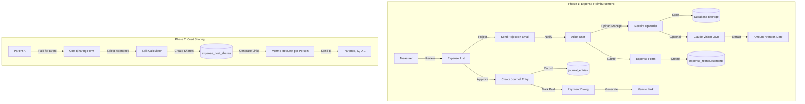

# Expense Reimbursement System Implementation Plan

> **Status:** In Progress
> **Created:** 2026-02-15
> **Author:** Claude

---

## 1. Requirements

### 1.1 Problem Statement

Adult volunteers and parents regularly incur expenses on behalf of the troop (supplies, food, transportation, event fees). Currently, there's no standardized way to:
- Submit expense reimbursement requests with documentation
- Track pending vs. approved vs. paid expenses
- Record reimbursements in the accounting system
- Facilitate payments back to adults

### 1.2 User Stories

**Phase 1 - Expense Submission & Approval:**
- [x] As an adult, I want to upload a receipt photo so that I can request reimbursement for expenses I incurred
- [x] As an adult, I want the app to optionally extract amount/vendor from my receipt so that I don't have to type everything manually
- [x] As a treasurer, I want to see all pending expense requests so that I can review and approve them
- [x] As a treasurer, I want to approve or reject expenses with notes so that adults know the status
- [x] As a treasurer, I want approved expenses recorded in the accounting system so that our books are accurate
- [x] As an adult, I want to be notified when my expense is approved/rejected so that I know the status
- [x] As an adult, I want to edit and resubmit rejected expenses so that I can fix issues

**Phase 2 - Payment Facilitation:**
- [x] As a treasurer, I want to generate a Venmo payment request link so that I can easily pay reimbursements
- [x] As a parent, I want to split event costs among attendees so that one person doesn't bear the full expense
- [x] As a parent, I want to generate payment request links to send to other parents so that I can collect my share

### 1.3 Acceptance Criteria

**Phase 1:**
- [ ] Any adult with unit access can submit expense requests
- [ ] Receipt images can be uploaded (JPG, PNG, PDF, max 10MB)
- [ ] Optional AI extraction suggests amount, vendor, date (user confirms)
- [ ] Simple categories: Supplies, Food, Travel, Other
- [ ] Treasurer sees list of all expenses with status filtering
- [ ] Approve/reject workflow with notes
- [ ] Approved expenses create journal entries (debit expense account, credit cash)
- [ ] Payment status tracking (approved ≠ paid)
- [ ] Email notifications on status changes
- [ ] Rejected expenses can be edited and resubmitted

**Phase 2:**
- [ ] Treasurer can generate Venmo payment link for approved expenses
- [ ] Cost-sharing feature: select attendees, enter total, calculate split
- [ ] Generate payment request links per person
- [ ] Track who has paid their share

### 1.4 Out of Scope

- Full Venmo API integration (only deep links)
- PayPal, Zelle, or other payment platforms (Phase 2 only covers Venmo)
- Pre-approval workflows for large expenses
- Linking expenses to specific events (standalone records)
- Multi-currency support
- Recurring/scheduled expenses
- Budget tracking against expense categories

### 1.5 Open Questions

| Question | Answer | Decided By |
|----------|--------|------------|
| Who can submit expenses? | Any adult with unit access | User |
| Post-approval workflow? | Journal entry + payment tracking | User |
| Categories? | Simple list (supplies, food, travel, other) | User |
| Receipt OCR? | Optional AI extraction, user confirms | User |
| Payment integration level? | Venmo payment request links | User |
| Expense-event linking? | Not required | User |
| Rejection workflow? | Edit + resubmit with notification | User |

---

## 2. Technical Design

### 2.1 Approach

**Phase 1 Architecture:**
1. **New `expense_reimbursements` table** - Stores expense requests with status workflow
2. **Supabase Storage bucket** - `expense-receipts` for uploaded images/PDFs
3. **Server Actions** - Follow existing pattern from `signoff-actions.ts`
4. **Journal Entry Integration** - Use existing pattern from `credit_fundraising_to_scout`
5. **Email Notifications** - Extend existing Resend integration
6. **Receipt OCR** - Use Claude Vision API (optional, user confirms)

**Phase 2 Architecture (Cost Sharing):**
1. **Separate from billing & troop ledger** - Cost sharing is parent-to-parent; NO journal entries, NO impact on troop finances
2. **Scout-based split, family-grouped requests** - Split by scout attendance, but payment requests combine siblings
3. **Auto-exclude submitter's kids** - Submitting parent's children don't generate payment requests
4. **Venmo Deep Links** - URL format: `https://venmo.com/{username}?txn=charge&amount=X&note=...`

**Key Distinction:**
| Feature | Troop Ledger Impact |
|---------|---------------------|
| Expense Reimbursement (Phase 1-3) | ✅ Creates journal entry (Debit Expense, Credit Cash) |
| Parent Cost Sharing (Phase 4) | ❌ None - peer-to-peer IOU tracker only |

**Example Cost Sharing Flow:**
- Parent A pays $200 for campsite, 10 scouts attended (including Parent A's 2 kids)
- Split: $200 ÷ 10 = $20/scout
- Parent A's kids: 2 × $20 = $40 (auto-covered, no request)
- Amount to collect: $160 from other families
- If Parent B has 2 kids who attended: single request for $40 (combined)

**Payment Method Scope:**
- **Troop → Adult reimbursements**: Payment handled outside Chuckbox (check, Zelle, bank transfer). App tracks approval status and marks as "paid" when treasurer confirms.
- **Parent → Parent cost sharing (Phase 4)**: Venmo links for peer-to-peer payments between parents.

**Why This Approach:**
- Follows existing patterns (journal entries, approval workflows, file uploads)
- Uses services already in the stack (Supabase Storage, Resend, Anthropic)
- Venmo deep links require no API keys or merchant accounts
- Claude Vision is already available via Anthropic API

### 2.2 Database Changes

```sql
-- Migration: 20260215000000_add_venmo_to_profiles.sql

-- Add Venmo username to profiles for payment facilitation
ALTER TABLE profiles ADD COLUMN IF NOT EXISTS venmo_username TEXT;

COMMENT ON COLUMN profiles.venmo_username IS 'User Venmo username for receiving reimbursements and cost-sharing payments';
```

```sql
-- Migration: 20260215000001_expense_reimbursements.sql

-- Expense categories enum
CREATE TYPE expense_category AS ENUM ('supplies', 'food', 'travel', 'other');

-- Expense status enum
CREATE TYPE expense_status AS ENUM ('draft', 'submitted', 'approved', 'rejected', 'paid');

-- Main expense reimbursements table
CREATE TABLE expense_reimbursements (
    id UUID PRIMARY KEY DEFAULT gen_random_uuid(),
    unit_id UUID NOT NULL REFERENCES units(id) ON DELETE CASCADE,
    submitter_id UUID NOT NULL REFERENCES profiles(id),

    -- Expense details
    description TEXT NOT NULL,
    amount DECIMAL(10,2) NOT NULL CHECK (amount > 0),
    expense_date DATE NOT NULL,
    category expense_category NOT NULL DEFAULT 'other',
    vendor TEXT,

    -- Receipt
    receipt_url TEXT,
    receipt_filename TEXT,

    -- AI extraction metadata (optional)
    ai_extracted BOOLEAN DEFAULT FALSE,
    ai_extraction_data JSONB,

    -- Workflow status
    status expense_status NOT NULL DEFAULT 'draft',

    -- Submission
    submitted_at TIMESTAMPTZ,

    -- Review
    reviewed_by UUID REFERENCES profiles(id),
    reviewed_at TIMESTAMPTZ,
    review_notes TEXT,
    rejection_reason TEXT,

    -- Payment
    paid_at TIMESTAMPTZ,
    paid_by UUID REFERENCES profiles(id),
    payment_method TEXT,
    payment_reference TEXT,

    -- Journal entry (created on approval/payment)
    journal_entry_id UUID REFERENCES journal_entries(id),

    -- Timestamps
    created_at TIMESTAMPTZ NOT NULL DEFAULT NOW(),
    updated_at TIMESTAMPTZ NOT NULL DEFAULT NOW()
);

-- Indexes
CREATE INDEX idx_expense_reimbursements_unit ON expense_reimbursements(unit_id);
CREATE INDEX idx_expense_reimbursements_submitter ON expense_reimbursements(submitter_id);
CREATE INDEX idx_expense_reimbursements_status ON expense_reimbursements(status);
CREATE INDEX idx_expense_reimbursements_unit_status ON expense_reimbursements(unit_id, status);

-- RLS Policies
ALTER TABLE expense_reimbursements ENABLE ROW LEVEL SECURITY;

-- Adults can view their own expenses
CREATE POLICY "Users can view own expenses"
ON expense_reimbursements FOR SELECT
USING (submitter_id = auth.uid());

-- Admins/treasurers can view all unit expenses
CREATE POLICY "Admins can view unit expenses"
ON expense_reimbursements FOR SELECT
USING (
    EXISTS (
        SELECT 1 FROM unit_memberships
        WHERE unit_memberships.unit_id = expense_reimbursements.unit_id
        AND unit_memberships.profile_id = auth.uid()
        AND unit_memberships.role IN ('admin', 'treasurer')
        AND unit_memberships.status = 'active'
    )
);

-- Adults can insert their own expenses
CREATE POLICY "Users can create expenses"
ON expense_reimbursements FOR INSERT
WITH CHECK (
    submitter_id = auth.uid()
    AND EXISTS (
        SELECT 1 FROM unit_memberships
        WHERE unit_memberships.unit_id = expense_reimbursements.unit_id
        AND unit_memberships.profile_id = auth.uid()
        AND unit_memberships.status = 'active'
    )
);

-- Users can update their own draft/rejected expenses
CREATE POLICY "Users can update own draft expenses"
ON expense_reimbursements FOR UPDATE
USING (
    submitter_id = auth.uid()
    AND status IN ('draft', 'rejected')
);

-- Admins/treasurers can update any unit expense
CREATE POLICY "Admins can update unit expenses"
ON expense_reimbursements FOR UPDATE
USING (
    EXISTS (
        SELECT 1 FROM unit_memberships
        WHERE unit_memberships.unit_id = expense_reimbursements.unit_id
        AND unit_memberships.profile_id = auth.uid()
        AND unit_memberships.role IN ('admin', 'treasurer')
        AND unit_memberships.status = 'active'
    )
);

-- Updated_at trigger
CREATE TRIGGER set_expense_reimbursements_updated_at
    BEFORE UPDATE ON expense_reimbursements
    FOR EACH ROW
    EXECUTE FUNCTION update_updated_at_column();
```

**Phase 2 Migration (Cost Sharing):**
```sql
-- Migration: 20260215000002_expense_cost_sharing.sql

CREATE TYPE cost_share_status AS ENUM ('pending', 'paid', 'declined');

CREATE TABLE expense_cost_shares (
    id UUID PRIMARY KEY DEFAULT gen_random_uuid(),
    unit_id UUID NOT NULL REFERENCES units(id) ON DELETE CASCADE,

    -- Organizer (person who paid initially)
    organizer_id UUID NOT NULL REFERENCES profiles(id),

    -- Share details
    description TEXT NOT NULL,
    total_amount DECIMAL(10,2) NOT NULL CHECK (total_amount > 0),
    share_amount DECIMAL(10,2) NOT NULL CHECK (share_amount > 0),

    -- Participant owing money
    participant_id UUID NOT NULL REFERENCES profiles(id),

    -- Payment info
    status cost_share_status NOT NULL DEFAULT 'pending',
    paid_at TIMESTAMPTZ,

    -- Venmo info for organizer
    organizer_venmo TEXT,

    -- Timestamps
    created_at TIMESTAMPTZ NOT NULL DEFAULT NOW(),
    updated_at TIMESTAMPTZ NOT NULL DEFAULT NOW()
);

CREATE INDEX idx_expense_cost_shares_organizer ON expense_cost_shares(organizer_id);
CREATE INDEX idx_expense_cost_shares_participant ON expense_cost_shares(participant_id);
CREATE INDEX idx_expense_cost_shares_unit ON expense_cost_shares(unit_id);
```

### 2.3 API/Server Actions

| Action | Purpose |
|--------|---------|
| `createExpenseReimbursement` | Create new expense (draft or submitted) |
| `updateExpenseReimbursement` | Edit draft/rejected expense |
| `submitExpenseReimbursement` | Change status from draft to submitted |
| `approveExpenseReimbursement` | Approve + create journal entry |
| `rejectExpenseReimbursement` | Reject with reason |
| `markExpensePaid` | Record payment details |
| `extractReceiptData` | Call Claude Vision API for OCR |
| `uploadExpenseReceipt` | Upload receipt to Supabase Storage |
| `deleteExpenseReceipt` | Remove receipt from storage |
| `getExpenseReimbursements` | List expenses with filters |
| `createCostShare` | Create cost-sharing record (Phase 2) |
| `generateVenmoLink` | Generate Venmo payment request URL |

### 2.4 UI Components

| Component | Location | Purpose |
|-----------|----------|---------|
| `ExpenseReimbursementForm` | `src/components/expenses/expense-form.tsx` | Create/edit expense with receipt upload |
| `ExpenseReimbursementList` | `src/components/expenses/expense-list.tsx` | List view with status filters |
| `ExpenseReimbursementCard` | `src/components/expenses/expense-card.tsx` | Individual expense display |
| `ExpenseApprovalDialog` | `src/components/expenses/approval-dialog.tsx` | Approve/reject modal |
| `ExpensePaymentDialog` | `src/components/expenses/payment-dialog.tsx` | Mark paid + Venmo link |
| `ReceiptUploader` | `src/components/expenses/receipt-uploader.tsx` | Drag-drop receipt upload |
| `ReceiptViewer` | `src/components/expenses/receipt-viewer.tsx` | View receipt image/PDF |
| `CostSharingForm` | `src/components/expenses/cost-sharing-form.tsx` | Split costs (Phase 2) |
| `ExpensesPage` | `src/app/(dashboard)/expenses/page.tsx` | Main expenses page |

### 2.5 Architecture Diagram



---

## 3. Implementation Tasks

**Task Numbering:** `{Phase}.{Section}.{Task}` (e.g., 0.1.1, 1.2.3)

### Phase 0: Foundation

#### 0.1 Database Setup
- [x] **0.1.1** Add venmo_username to profiles
  - Files: `supabase/migrations/20260216000000_add_venmo_to_profiles.sql`
  - Test: Column exists on profiles table

- [x] **0.1.2** Create expense_reimbursements migration
  - Files: `supabase/migrations/20260216000001_expense_reimbursements.sql`
  - Test: `supabase db push` succeeds, table created

- [x] **0.1.3** Create Supabase Storage bucket for receipts
  - Files: `supabase/migrations/20260216000002_expense_receipts_storage.sql`
  - Test: `expense-receipts` bucket exists with RLS policies

- [x] **0.1.4** Regenerate TypeScript types
  - Files: `src/types/database.ts`
  - Test: Types include `expense_reimbursements` table, profiles has venmo_username

#### 0.2 Core Types & Utilities
- [x] **0.2.1** Create expense types and constants
  - Files: `src/lib/expenses/types.ts`, `src/lib/expenses/constants.ts`, `src/lib/expenses/index.ts`
  - Test: Enums and interfaces compile

- [x] **0.2.2** Create expense validation schemas (Zod)
  - Files: `src/lib/expenses/schemas.ts`
  - Test: Schema validates sample data

#### 0.3 User Payment Info (for Phase 4)
- [x] **0.3.1** Add Venmo settings to user profile page
  - Files: `src/components/settings/venmo-settings-card.tsx`, `src/app/(dashboard)/profile/page.tsx`, `src/app/actions/profile.ts`
  - Test: User can view/edit their Venmo username
  - Note: Used in Phase 4 for cost sharing - optional for Phase 1-3

---

### Phase 1: Expense Submission

#### 1.1 Receipt Upload
- [x] **1.1.1** Create receipt upload API route
  - Files: `src/app/api/expenses/receipt/route.ts`
  - Test: POST uploads file to Supabase Storage

- [x] **1.1.2** Create ReceiptUploader component
  - Files: `src/components/expenses/receipt-uploader.tsx`
  - Test: Drag-drop uploads, shows preview

- [x] **1.1.3** Create ReceiptViewer component
  - Files: `src/components/expenses/receipt-viewer.tsx`
  - Test: Displays images and PDFs

#### 1.2 Receipt OCR (Optional)
- [x] **1.2.1** Create receipt extraction API route
  - Files: `src/app/api/expenses/extract/route.ts`
  - Test: POST with image returns extracted data

- [x] **1.2.2** Integrate Claude Vision for OCR
  - Files: `src/lib/expenses/receipt-ocr.ts`
  - Test: Extracts amount, vendor, date from test receipt

#### 1.3 Expense Form
- [x] **1.3.1** Create expense submission server actions
  - Files: `src/app/actions/expenses.ts`
  - Test: createExpense, updateExpense work

- [x] **1.3.2** Create ExpenseReimbursementForm component
  - Files: `src/components/expenses/expense-form.tsx`
  - Test: Form submits, creates database record

- [x] **1.3.3** Create expense submission page
  - Files: `src/app/(dashboard)/expenses/new/page.tsx`
  - Test: Page renders, form works

#### 1.4 Expense List & Status
- [x] **1.4.1** Create expense list server action
  - Files: `src/app/actions/expenses.ts` (getExpenses)
  - Test: Returns filtered expenses for unit

- [x] **1.4.2** Create ExpenseReimbursementCard component
  - Files: `src/components/expenses/expense-card.tsx`
  - Test: Displays expense with status badge

- [x] **1.4.3** Create ExpenseReimbursementList component
  - Files: `src/components/expenses/expense-list.tsx`
  - Test: Lists expenses with status filters

- [x] **1.4.4** Create expenses page
  - Files: `src/app/(dashboard)/expenses/page.tsx`
  - Test: Page shows user's expenses

---

### Phase 2: Approval Workflow

#### 2.1 Treasurer Review
- [x] **2.1.1** Create approval server actions
  - Files: `src/app/actions/expenses.ts` (approve, reject)
  - Test: Status updates, reviewed_by set

- [x] **2.1.2** Create ExpenseApprovalDialog component
  - Files: `src/components/expenses/expense-approval-dialog.tsx`
  - Test: Shows expense details, approve/reject buttons

- [x] **2.1.3** Add treasurer view to expenses page
  - Files: `src/app/(dashboard)/expenses/page.tsx`
  - Test: Treasurer sees all unit expenses

#### 2.2 Journal Entry Integration
- [x] **2.2.1** Create expense journal entry RPC function
  - Files: `supabase/migrations/20260216000002_expense_journal_rpc.sql`
  - Test: Creates proper debit/credit entries

- [x] **2.2.2** Integrate journal entry on approval
  - Files: `src/app/actions/expenses.ts`
  - Test: Approved expense has journal_entry_id

#### 2.3 Payment Tracking
- [x] **2.3.1** Create mark-paid server action
  - Files: `src/app/actions/expenses.ts` (markPaid)
  - Test: Updates paid_at, paid_by, payment_method, payment_reference

- [x] **2.3.2** Create ExpensePaymentDialog component
  - Files: `src/components/expenses/expense-payment-dialog.tsx`
  - Test: Records payment method (check/Zelle/other) and reference number

---

### Phase 3: Notifications & Resubmission

#### 3.1 Email Notifications
- [x] **3.1.1** Create expense email templates
  - Files: `src/lib/email/templates/expense-*.ts`
  - Test: Templates render correctly

- [x] **3.1.2** Send notification on approval
  - Files: `src/app/actions/expenses.ts`
  - Test: Email sent to submitter

- [x] **3.1.3** Send notification on rejection
  - Files: `src/app/actions/expenses.ts`
  - Test: Email includes rejection reason

#### 3.2 Resubmission
- [x] **3.2.1** Enable edit on rejected expenses
  - Files: `src/app/(dashboard)/expenses/[id]/edit/page.tsx`
  - Test: Can edit and resubmit rejected expense

- [x] **3.2.2** Clear rejection state on resubmit
  - Files: `src/app/actions/expenses.ts`
  - Test: Resubmit sets status back to submitted

---

<!-- MVP BOUNDARY - Everything above is Phase 1 MVP -->

### Phase 4: Cost Sharing (Post-MVP)

#### 4.1 Cost Sharing Database
- [ ] **4.1.1** Create cost sharing migration
  - Files: `supabase/migrations/20260215000002_expense_cost_sharing.sql`
  - Test: Table created with RLS

#### 4.2 Venmo Integration
- [ ] **4.2.1** Create Venmo link generation utility
  - Files: `src/lib/expenses/venmo.ts`
  - Test: Generates correct URL with username/amount/note

- [ ] **4.2.2** Create VenmoPromptDialog for missing usernames
  - Files: `src/components/expenses/venmo-prompt-dialog.tsx`
  - Test: Prompts for username, saves to profile on confirm

#### 4.3 Cost Sharing UI
- [ ] **4.3.1** Create CostSharingForm component
  - Files: `src/components/expenses/cost-sharing-form.tsx`
  - Test: Select attendees, enter total, calculate per-person split

- [ ] **4.3.2** Create cost sharing server actions
  - Files: `src/app/actions/cost-sharing.ts`
  - Test: Creates share records for each participant

- [ ] **4.3.3** Generate payment request links per person
  - Files: Uses `src/lib/expenses/venmo.ts`
  - Test: Generates personalized Venmo links for each participant

- [ ] **4.3.4** Create CostShareTracker component
  - Files: `src/components/expenses/cost-share-tracker.tsx`
  - Test: Shows who has paid, allows marking shares as paid

---

## 4. Files to Create/Modify

### New Files
| File | Purpose |
|------|---------|
| `supabase/migrations/20260215000000_add_venmo_to_profiles.sql` | Add venmo_username to profiles |
| `supabase/migrations/20260215000001_expense_reimbursements.sql` | Main table migration |
| `supabase/migrations/20260215000003_expense_journal_rpc.sql` | Journal entry RPC |
| `src/lib/expenses/types.ts` | TypeScript types |
| `src/lib/expenses/constants.ts` | Categories, status labels |
| `src/lib/expenses/schemas.ts` | Zod validation schemas |
| `src/lib/expenses/receipt-ocr.ts` | Claude Vision integration |
| `src/app/actions/expenses.ts` | Server actions |
| `src/app/api/expenses/receipt/route.ts` | Receipt upload API |
| `src/app/api/expenses/extract/route.ts` | OCR extraction API |
| `src/components/expenses/expense-form.tsx` | Create/edit form |
| `src/components/expenses/expense-list.tsx` | List component |
| `src/components/expenses/expense-card.tsx` | Card component |
| `src/components/expenses/approval-dialog.tsx` | Approve/reject modal |
| `src/components/expenses/payment-dialog.tsx` | Payment recording |
| `src/components/expenses/receipt-uploader.tsx` | Upload component |
| `src/components/expenses/receipt-viewer.tsx` | View component |
| `src/app/(dashboard)/expenses/page.tsx` | Main expenses page |
| `src/app/(dashboard)/expenses/new/page.tsx` | New expense page |
| `src/app/(dashboard)/expenses/[id]/edit/page.tsx` | Edit expense page |
| `src/lib/email/templates/expense-submitted.ts` | Submission email |
| `src/lib/email/templates/expense-approved.ts` | Approval email |
| `src/lib/email/templates/expense-rejected.ts` | Rejection email |

### Phase 4 Files (Post-MVP)
| File | Purpose |
|------|---------|
| `supabase/migrations/20260215000002_expense_cost_sharing.sql` | Cost sharing table |
| `src/lib/expenses/venmo.ts` | Venmo link generation |
| `src/components/expenses/venmo-prompt-dialog.tsx` | Prompt for Venmo username |
| `src/components/expenses/cost-sharing-form.tsx` | Split costs UI |
| `src/components/expenses/cost-share-tracker.tsx` | Track who paid |
| `src/app/actions/cost-sharing.ts` | Cost sharing server actions |

### Modified Files
| File | Changes |
|------|---------|
| `src/types/database.ts` | Regenerate with new tables |
| `src/app/(dashboard)/layout.tsx` | Add expenses nav item |
| `src/components/nav/sidebar.tsx` | Add expenses link |
| `src/app/(dashboard)/settings/profile/page.tsx` | Add Venmo username field |

---

## 5. Testing Strategy

### Unit Tests
- [ ] Zod schemas validate correctly
- [ ] Venmo URL generation with special characters
- [ ] Receipt OCR response parsing
- [ ] Journal entry balance validation

### Integration Tests
- [ ] Receipt upload to Supabase Storage
- [ ] Full expense submission flow
- [ ] Approval creates journal entry
- [ ] RLS policies enforce access

### Manual Testing
- [ ] Upload various receipt formats (JPG, PNG, PDF)
- [ ] Test OCR on blurry/poor quality receipts
- [ ] Verify emails arrive and render correctly
- [ ] Test Venmo links open correctly on mobile
- [ ] Verify role-based access (parent can't approve)

---

## 6. Rollout Plan

### Dependencies
- Claude API key for vision (should already have ANTHROPIC_API_KEY)
- Supabase Storage bucket created
- RESEND_API_KEY for emails (already configured)

### Environment Variables
```bash
# Existing - should already be set
ANTHROPIC_API_KEY=...
RESEND_API_KEY=...
```

### Migration Steps
1. Run database migration
2. Create `expense-receipts` storage bucket
3. Deploy code changes
4. Verify RLS policies work

### Verification
1. Submit test expense as parent
2. Approve as treasurer, verify journal entry
3. Mark as paid, verify Venmo link
4. Test rejection and resubmission flow

---

## 7. Progress Summary

| Phase | Total | Complete | Status |
|-------|-------|----------|--------|
| Phase 0: Foundation | 7 | 7 | ✅ Complete |
| Phase 1: Expense Submission | 12 | 12 | ✅ Complete |
| Phase 2: Approval Workflow | 7 | 7 | ✅ Complete |
| Phase 3: Notifications | 5 | 5 | ✅ Complete |
| Phase 4: Cost Sharing (Post-MVP) | 7 | 0 | ⬜ Not Started |
| **Total** | **38** | **31** | |

**MVP Boundary:** Phases 0-3 (31 tasks) = Expense submission, approval, journal entry, notifications
**Post-MVP:** Phase 4 (7 tasks) = Parent-to-parent Venmo cost sharing

---

## 8. Task Log

| Task | Date | Commit | Notes |
|------|------|--------|-------|
| 0.1.1 | 2026-02-16 | 3f6b28f | Add venmo_username to profiles |
| 0.1.2 | 2026-02-16 | 60ba009 | Create expense_reimbursements table |
| 0.1.3 | 2026-02-16 | c1d24f8 | Create expense-receipts storage bucket |
| 0.1.4 | 2026-02-16 | c93ef8c | Regenerate TypeScript types |
| 0.2.1 | 2026-02-16 | 0a5787e | Create expense types and constants |
| 0.2.2 | 2026-02-16 | 347fa5e | Create Zod validation schemas |
| 0.3.1 | 2026-02-16 | 022961c | Add Venmo settings to profile page |
| 1.1.1 | 2026-02-16 | 3239bcc | Create receipt upload API route |
| 1.1.2 | 2026-02-16 | 3239bcc | Create ReceiptUploader component |
| 1.1.3 | 2026-02-16 | 3239bcc | Create ReceiptViewer component |
| 1.2.1 | 2026-02-16 | 3239bcc | Create receipt extraction API route |
| 1.2.2 | 2026-02-16 | 3239bcc | Integrate Claude Vision for OCR |
| 1.3.1 | 2026-02-16 | 016788b | Create expense submission server actions |
| 1.3.2 | 2026-02-16 | 016788b | Create ExpenseReimbursementForm component |
| 1.3.3 | 2026-02-16 | 016788b | Create expense submission page |
| 1.4.1 | 2026-02-16 | 016788b | Create expense list server action (in 1.3.1) |
| 1.4.2 | 2026-02-16 | 016788b | Create ExpenseReimbursementCard component |
| 1.4.3 | 2026-02-16 | b2642e3 | Create ExpenseReimbursementList component |
| 1.4.4 | 2026-02-16 | b2642e3 | Create expenses page |
| 2.1.1 | 2026-02-17 | — | Approve/reject server actions |
| 2.1.2 | 2026-02-17 | — | ExpenseApprovalDialog component |
| 2.1.3 | 2026-02-17 | — | Treasurer view (financial role sees all unit expenses) |
| 2.2.1 | 2026-02-17 | — | Expense journal entry RPC function |
| 2.2.2 | 2026-02-17 | — | Journal entry created on approval |
| 2.3.1 | 2026-02-17 | — | Mark-paid server action |
| 2.3.2 | 2026-02-17 | — | ExpensePaymentDialog component |
| — | 2026-02-17 | — | UI updates: dashboard quick action, profile expenses tab, finance subnav, roster button |
| — | 2026-02-18 | — | Fix: storage bucket RLS + public bucket, receipt upload via admin client |
| — | 2026-02-18 | — | Fix: RLS policies (auth.uid vs profile.id mismatch) |
| — | 2026-02-18 | — | Fix: ANTHROPIC_API_KEY uncommented, PDF OCR support added |
| — | 2026-02-18 | — | Create expense detail page (/expenses/[id]) |
| 3.1.1 | 2026-02-18 | 6634c30 | Expense approved/rejected email templates |
| 3.1.2 | 2026-02-18 | e5f9f37 | Send approval notification email |
| 3.1.3 | 2026-02-18 | af0c74e | Send rejection notification email |
| 3.2.1 | 2026-02-18 | f2a4318 | Edit page for rejected expenses |
| 3.2.2 | 2026-02-18 | 6b3d372 | Clear rejection state on resubmit |

---

## Research Notes

### Venmo Payment Links
URL format: `https://venmo.com/{username}?txn=charge&amount=X&note=...`

Parameters:
- `txn=charge` - Request payment (vs `pay` to send)
- `amount` - Dollar amount (no $ symbol)
- `note` - Payment description
- `audience` - public, friends, private
- `recipients` - Comma-separated usernames/emails/phones

Sources:
- [Venmo Payment Links](https://venmo.com/paymentlinks/)
- [Venmo Link Builder Tool](https://www.tonyherman.com/tools/venmo-link-builder/)

### Receipt OCR
Claude Vision can extract receipt data but may miss some details. For optional extraction where user confirms, this is acceptable. More robust options (AWS Textract) would require additional service integration.

Sources:
- [OCR Comparison 2025](https://www.marktechpost.com/2025/11/02/comparing-the-top-6-ocr-optical-character-recognition-models-systems-in-2025/)
- [Invoice AI Benchmark](https://www.businesswaretech.com/blog/research-best-ai-services-for-automatic-invoice-processing)

---

## Approval

- [ ] Requirements reviewed by: _____
- [ ] Technical design reviewed by: _____
- [ ] Ready for implementation
