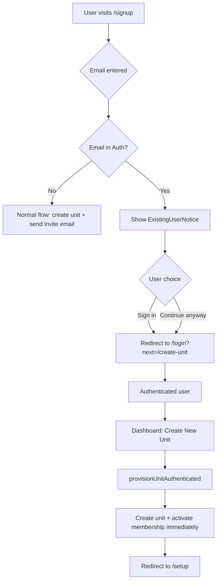

# Graceful Existing User Onboarding

> **Status:** Draft
> **Created:** 2026-03-25
> **Author:** Claude

---

## 1. Requirements

### 1.1 Problem Statement

When a user goes through the public onboarding flow (`/signup`) and their email already exists in Supabase Auth or is associated with an existing unit, the system silently fails to send the invite email (because `inviteUserByEmail` returns `email_exists`). The user sees a "check your email" screen but never receives an email. There is no feedback about what went wrong or how to proceed.

Additionally, authenticated users who want to create a second unit must go through the public onboarding flow again, which tries to re-invite them unnecessarily.

### 1.2 User Stories

- [ ] As a **new user whose email was previously used** (e.g., from a cancelled unit), I want to be told I already have an account and given a way to sign in, so I'm not stuck waiting for an email that never arrives.
- [ ] As an **existing user** creating a second unit, I want to skip email verification since I'm already authenticated, so the process is fast and seamless.
- [ ] As an **existing user**, I want to create a new unit from within the app (dashboard), so I don't have to go through the public signup flow again.
- [ ] As a **developer**, I want `db:fresh` to clear auth users in dev so I can test the full signup flow from scratch.

### 1.3 Acceptance Criteria

- [ ] Public onboarding detects existing auth users and shows appropriate messaging with sign-in option
- [ ] Authenticated users going through onboarding skip email verification — unit is created and linked immediately
- [ ] Dashboard has a "Create New Unit" option for authenticated users
- [ ] `db:fresh` clears Supabase auth users (dev environment only)
- [ ] No silent failures — every path gives clear user feedback
- [ ] Multi-unit membership works correctly (same email, multiple units)

### 1.4 Out of Scope

- Merging duplicate profiles across units
- Admin transfer between units
- Unit deletion flow
- Changing the Supabase email templates (handled separately)
- Paid unit creation (future monetization — Phase 2 should be designed to easily add a payment gate later)
- Production backup/disaster recovery strategy (separate initiative, see notes in Phase 0)

### 1.5 Open Questions

| Question | Answer | Decided By |
|----------|--------|------------|
| Skip email verification for authenticated users? | Yes — skip entirely | User |
| What to show existing users in onboarding? | Show info about existing account + offer sign-in or continue | User |
| In-app unit creation? | Yes — add to dashboard, low prominence | User |
| Clear auth users in db:fresh? | Yes — dev only, with hardcoded safeguard against prod | User |
| In-app "Create Unit" prominence? | Low — this is rare. Small link in settings or unit switcher, not a primary CTA | User |
| Future payment gate for unit creation? | Out of scope now, but Phase 2 design should make it easy to add | User |

---

## 2. Technical Design

### 2.1 Approach

Three changes working together:

1. **Early detection in `provisionUnit()`** — Before creating anything, check if the email exists in Supabase Auth. If so, branch the flow:
   - If the request includes a valid session (authenticated user) → skip invite email, directly create unit + activate membership
   - If no session → return a specific response telling the UI the user already has an account

2. **UI handling in SignupWizard** — When the backend reports an existing user, show an informational message with options to sign in or continue (which will redirect to sign in first, then complete unit creation).

3. **In-app "Create New Unit"** — A new route accessible from the dashboard sidebar that reuses the onboarding components but skips all auth steps since the user is already logged in.

### 2.2 Database Changes

No schema changes needed. The existing `unit_memberships` table already supports multi-unit membership.

### 2.3 API/Server Actions

| Action | Purpose |
|--------|---------|
| `provisionUnit()` (modify) | Add early email/auth check, support authenticated user path |
| `provisionUnitAuthenticated()` (new) | Create unit for already-authenticated user — no invite email, direct activation |
| `checkEmailExists()` (new) | Lightweight check if email is in auth system (for frontend validation) |

**`provisionUnit()` changes:**
```
Before creating unit:
  1. Check if email exists in Supabase Auth (admin.listUsers filter)
  2. If exists → return { success: false, existingUser: true, error: 'account_exists' }
  3. Frontend handles this by showing sign-in prompt
```

**`provisionUnitAuthenticated()` flow:**
```
1. Verify caller is authenticated (getUser)
2. Run same validations (rate limit, duplicate unit check)
3. Create unit, profile (or reuse existing), membership
4. Set membership status='active' immediately (no invite needed)
5. Stage + import roster data synchronously
6. Return { success: true, unitId, redirectTo: '/setup' }
```

### 2.4 UI Components

| Component | Location | Purpose |
|-----------|----------|---------|
| `ExistingUserNotice` | `src/components/onboarding/existing-user-notice.tsx` | Shows "you already have an account" message with sign-in link |
| `CreateUnitPage` | `src/app/(dashboard)/create-unit/page.tsx` | In-app unit creation for authenticated users |
| Sidebar update | `src/components/sidebar.tsx` (or equivalent) | Add "Create New Unit" link |

### 2.5 Architecture Diagram



---

## 3. Implementation Tasks

### Phase 0: Foundation

#### 0.1 Dev Tooling & Safety
- [x] **0.1.1** ~~Add auth user cleanup to `db:fresh`~~ — **DROPPED**
  - Reason: Automating auth user deletion in any environment is too risky. The server action changes in 0.2.x solve the root problem (silent failure) by detecting existing auth users before attempting `inviteUserByEmail`. Stale auth users in dev are a minor inconvenience, not a blocker.

> **Note — Production Data Protection (Future Initiative):**
> As users come online, we need a separate plan for production safeguards:
> - Supabase Point-in-Time Recovery (PITR) — available on Pro plan, continuous backups
> - Scheduled logical backups (pg_dump via cron or Supabase CLI)
> - RLS policy audit to prevent accidental cross-unit data exposure
> - Migration dry-run process (test against a branch database before pushing to prod)
> - Runbook for disaster recovery scenarios
> This is out of scope for this plan but should be prioritized before launch.

#### 0.2 Server Actions
- [x] **0.2.1** Add `checkEmailExists()` server action
  - Files: `src/app/actions/onboarding.ts`
  - Details: Uses admin client to check if email exists in auth. Returns `{ exists: boolean }`. Rate-limited.
  - Test: Unit test with mock admin client

- [x] **0.2.2** Modify `provisionUnit()` to detect existing auth users
  - Files: `src/app/actions/onboarding.ts`
  - Details: Before creating unit/profile, check auth. If email exists, return `{ success: false, code: 'account_exists' }` instead of silently failing on `inviteUserByEmail`.
  - Test: Unit test — existing email returns `account_exists` code

- [ ] **0.2.3** Create `provisionUnitAuthenticated()` server action
  - Files: `src/app/actions/onboarding.ts`
  - Details: For authenticated users — creates unit, reuses existing profile, sets membership to active, imports roster. No invite email.
  - Test: Unit test — creates unit with active membership, no email sent

---

### Phase 1: Public Onboarding Improvements

#### 1.1 Existing User Detection UI
- [ ] **1.1.1** Create `ExistingUserNotice` component
  - Files: `src/components/onboarding/existing-user-notice.tsx`
  - Details: Card showing "You already have a ChuckBox account" with info about existing unit(s). Two CTAs: "Sign In to Continue" (primary) and "Back" (secondary). Sign-in link includes `?next=/create-unit` so after login, user lands on the in-app unit creation flow.
  - Test: Component renders with sign-in link

- [ ] **1.1.2** Update SignupWizard to handle `account_exists` response
  - Files: `src/components/onboarding/signup-wizard.tsx`
  - Details: When `provisionUnit()` returns `account_exists`, show `ExistingUserNotice` instead of "check your email". Pass the error code through state.
  - Test: Manual — enter existing email in signup, see notice instead of email prompt

#### 1.2 Authenticated User Bypass
- [ ] **1.2.1** Detect authenticated user in signup page and redirect
  - Files: `src/lib/supabase/middleware.ts`
  - Details: Currently `/signup` is a public route — authenticated users can navigate there freely (confirmed in middleware). Add a redirect in `updateSession()`: if user is authenticated and path is `/signup`, redirect to `/create-unit`. This matches the existing pattern that redirects authenticated `/login` users to `/scouts` (line 54).
  - Test: Logged-in user visiting `/signup` redirects to `/create-unit`

---

<!-- MVP BOUNDARY -->

### Phase 2: In-App Unit Creation

#### 2.1 Create Unit Route
- [ ] **2.1.1** Create `/create-unit` page
  - Files: `src/app/(dashboard)/create-unit/page.tsx`
  - Details: Protected route. Reuses CSV uploader and onboarding form components. Calls `provisionUnitAuthenticated()` instead of `provisionUnit()`. Skips email step entirely.
  - Test: Authenticated user can create a second unit, lands on `/setup`

- [ ] **2.1.2** Create `CreateUnitWizard` component
  - Files: `src/components/onboarding/create-unit-wizard.tsx`
  - Details: Simplified wizard — unit info + CSV upload + confirm. No email/auth steps. Reuses `csv-uploader.tsx` and `roster-preview.tsx`.
  - Test: Component renders, submits, creates unit

#### 2.2 Navigation
- [ ] **2.2.1** Add "Create New Unit" link in Settings page
  - Files: Settings page component (identify exact file)
  - Details: Add a "Create New Unit" link under an "Account" or "Units" section in Settings. This is a rare, infrequent action — Settings is the appropriate home. Keep it low-prominence (text link or small card, not a primary CTA). **Future:** This is where a payment gate would be inserted when unit creation becomes paid.
  - Test: Link visible in Settings, navigates to `/create-unit`

- [ ] **2.2.2** Add unit switcher UI (conditional — multi-unit users only)
  - Files: `src/components/dashboard/sidebar.tsx`, new `src/components/dashboard/unit-switcher.tsx`
  - Details: Replace the static `UnitLogo` in the sidebar with a clickable unit switcher dropdown — but **only when the user has 2+ units**. Single-unit users see the current static logo. The dropdown lists all units and includes a muted "+ Add another unit" link at the bottom. Wires into the existing `UnitContext.switchUnit()` method.
  - Test: Single-unit user sees static logo. Multi-unit user sees dropdown with unit list + create link.

---

## 4. Files to Create/Modify

### New Files
| File | Purpose |
|------|---------|
| `src/components/onboarding/existing-user-notice.tsx` | Informs existing users and offers sign-in |
| `src/app/(dashboard)/create-unit/page.tsx` | In-app unit creation for authenticated users |
| `src/components/onboarding/create-unit-wizard.tsx` | Simplified wizard (no auth steps) |
| `src/components/dashboard/unit-switcher.tsx` | Conditional unit switcher dropdown (multi-unit users only) |

### Modified Files
| File | Changes |
|------|---------|
| `scripts/db.ts` | Add auth user cleanup to reset command with prod safeguard |
| `src/app/actions/onboarding.ts` | Add `checkEmailExists()`, `provisionUnitAuthenticated()`, modify `provisionUnit()` |
| `src/components/onboarding/signup-wizard.tsx` | Handle `account_exists` response, show `ExistingUserNotice` |
| `src/lib/supabase/middleware.ts` | Redirect authenticated `/signup` users to `/create-unit` |
| Settings page | Add "Create New Unit" link under Account/Units section |
| `src/components/dashboard/sidebar.tsx` | Replace static `UnitLogo` with conditional `UnitSwitcher` |

---

## 5. Testing Strategy

### Unit Tests
- [ ] `checkEmailExists()` returns true/false correctly
- [ ] `provisionUnit()` returns `account_exists` for existing emails
- [ ] `provisionUnitAuthenticated()` creates unit with active membership
- [ ] `provisionUnitAuthenticated()` reuses existing profile (no duplicates)

### Manual Testing
- [ ] New user signup: full flow works (invite email received in Inbucket)
- [ ] Existing auth user signup: sees `ExistingUserNotice` with sign-in link
- [ ] After sign-in, redirected to `/create-unit` to complete unit creation
- [ ] Authenticated user creates second unit from dashboard
- [ ] Unit switcher shows both units after creating second unit
- [ ] `db:fresh` clears auth users and allows clean re-test

---

## 6. Rollout Plan

### Dependencies
- None — all changes are backwards-compatible

### Migration Steps
1. Deploy code changes (no database migration needed)
2. Update Supabase email templates in production (separate task)

### Verification
1. Create a fresh account via `/signup` — full flow works
2. Try `/signup` again with same email — see existing user notice
3. Sign in, create second unit from dashboard
4. Verify both units accessible via unit switcher

---

## 7. Progress Summary

| Phase | Total | Complete | Status |
|-------|-------|----------|--------|
| Phase 0 | 4 | 0 | Not Started |
| Phase 1 | 3 | 0 | Not Started |
| Phase 2 | 4 | 0 | Not Started |

---

## 8. Task Log

| Task | Date | Commit | Notes |
|------|------|--------|-------|
| 0.1.1 | 2026-03-27 | — | DROPPED: automated auth user deletion too risky |
| 0.2.1 | 2026-03-27 | ce52d74 | checkEmailExists() added with 3 unit tests |
| 0.2.2 | 2026-03-27 | pending | provisionUnit() returns account_exists for existing emails |

---

## Approval

- [ ] Requirements reviewed by: _____
- [ ] Technical design reviewed by: _____
- [ ] Ready for implementation
