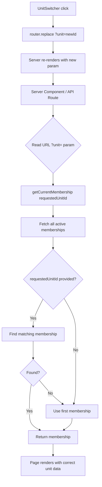

# Multi-Unit Page Refactor & Feature Flag

> **Status:** In Progress
> **Created:** 2026-04-06
> **Author:** Claude
> **Depends on:** [graceful-existing-user-onboarding.md](./graceful-existing-user-onboarding.md) (Phase 2 must be flagged off until this is complete)

---

## 1. Requirements

### 1.1 Problem Statement

Phase 2 of the graceful onboarding plan introduced in-app unit creation. This unintentionally exposed a latent bug: **60 files** in the codebase use `unit_memberships ... .single()`, which assumes the user has exactly one active membership. When a user creates a second unit, these queries either:

- Throw a PostgREST error ("multiple rows returned"), causing pages to show "No Unit Access"
- Or silently pick an arbitrary row, ignoring the URL `?unit=` param the unit switcher sets

The currently-working pages (`/dashboard` after the hot-fix in `8235af1`) prove the pattern works, but only one of 60 files has been fixed.

We need to:
1. **Hide Phase 2's UI** behind a feature flag so real users can't trigger this bug
2. **Refactor all 60 files** to support multi-unit users via a shared helper
3. **Unflag Phase 2** once the refactor is verified

### 1.2 User Stories

- [ ] As a **dev**, I want Phase 2's UI hidden behind a flag so I can keep iterating without exposing the bug to real users
- [ ] As a **multi-unit user**, every dashboard page should show data for the unit I selected in the unit switcher, not an arbitrary one
- [ ] As a **single-unit user**, my experience should not change at all
- [ ] As a **dev**, I want a single helper that handles unit selection so I don't have to remember the lookup pattern in 60 places
- [ ] As a **dev**, I want a lint rule that prevents future code from regressing to the broken `.single()` pattern

### 1.3 Acceptance Criteria

- [ ] `MULTI_UNIT_CREATION` feature flag exists and defaults to `false` in prod
- [ ] When flag is OFF: Settings link, unit switcher dropdown, and `/create-unit` page are hidden / inaccessible
- [ ] `provisionUnitAuthenticated()` server action remains callable (UI-only gate, per user choice)
- [ ] All 60 affected files use a shared helper that handles multi-membership lookup
- [ ] The helper accepts an optional `unitId` (from URL `?unit=` param) and falls back to first membership
- [ ] Single-unit users see no behavioral change (same data, same routes)
- [ ] Multi-unit users can switch units via the sidebar dropdown and have all pages reflect the selection
- [ ] An ESLint rule fails the build if new code uses `.single()` on `unit_memberships`
- [ ] Feature flag is removed at the end, after refactor is verified

### 1.4 Out of Scope

- Cross-unit data views (e.g. "show all my scouts across units"). Each page shows one unit at a time.
- Permissions/role differences across units. A user can be admin in unit A and parent in unit B — that already works at the membership level, this plan just makes pages respect it.
- Migrating `getCurrentMembership()` callers in `src/lib/auth.ts` and `src/lib/data/cached-queries.ts` — those are the helpers themselves, they're being updated, not migrated.
- Refactoring SQL functions / RPCs that hard-code unit lookups (none exist for memberships).
- Mobile nav unit switcher (separate task — only desktop sidebar has it today).

### 1.5 Open Questions

| Question | Answer | Decided By |
|----------|--------|------------|
| Flag scope: UI-only vs. server action too? | UI-only — server action stays callable | User |
| Refactor pattern? | Route-level wrapper (extend existing `cached-queries.ts` helper) | User |
| Rollout: refactor first then unflag? | Refactor first, then unflag | User |
| Default unit when no `?unit=` param? | First membership; URL is single source of truth | User |
| Should `last_active_unit_id` be persisted? | No (out of scope — URL + localStorage in client context is enough) | Implied from "first membership" choice |

---

## 2. Technical Design

### 2.1 Approach

Three components working together:

**A. Feature Flag (Phase 0)**
Add `MULTI_UNIT_CREATION` to `src/lib/feature-flags.ts`. Wrap the three Phase 2 UI surfaces:
- Settings page "Create another unit" link → hide if flag off
- Sidebar `UnitSwitcher` → hide dropdown variant if flag off, always show static logo
- `/create-unit` page → return `notFound()` if flag off

The server action `provisionUnitAuthenticated()` stays callable (per user choice). This means tests still work, and the feature can be exercised in dev with the flag on.

**B. Shared Helper (Phase 1)**
Extend the existing `getCurrentMembership()` helper in `src/lib/data/cached-queries.ts` to:
- Accept an optional `requestedUnitId` parameter
- Fetch ALL active memberships (not `.single()`)
- Return the membership matching `requestedUnitId`, or fall back to the first membership
- Stay `cache()`-wrapped for per-request memoization

Same shape for the existing simpler `getCurrentMembership()` in `src/lib/auth.ts` (used by 0 files we're migrating, but kept in sync for consistency).

**C. Page Migration (Phase 2-4)**
Migrate the 60 files in waves grouped by route area, prioritizing high-traffic paths:

| Wave | Area | Files | Risk |
|------|------|-------|------|
| Wave A | Finances pages | 6 | High — money + most frequent use |
| Wave B | Roster / Scouts / Adults pages | 4 | High — primary navigation |
| Wave C | Expenses pages | 5 | Medium — transactional |
| Wave D | Advancement / Settings pages | 4 | Medium |
| Wave E | API routes (read-only) | ~25 | Medium — same fix, no UI |
| Wave F | API routes (mutations) | ~16 | Higher — must verify unit ID is also enforced server-side, not just trusted from URL |

Each wave is its own task. Each file follows the same mechanical change:

```typescript
// Before
const { data: membership } = await supabase
  .from('unit_memberships')
  .select('unit_id, role')
  .eq('profile_id', profile.id)
  .eq('status', 'active')
  .single()
if (!membership) { /* error */ }

// After
const requestedUnitId = (await searchParams).unit  // pages
// or
const requestedUnitId = request.nextUrl.searchParams.get('unit')  // API routes

const membership = await getCurrentMembership(requestedUnitId)
if (!membership) { /* error */ }
```

For pages: signature changes to accept `searchParams` if it doesn't already.
For API routes: read `?unit=` from `request.nextUrl.searchParams`. For mutation routes (POST/PATCH/DELETE) where the unit comes from a body field or row ownership, no change is needed beyond the helper swap (the existing row-level RLS already enforces unit ownership).

**Critical: API route mutation safety**
For Wave F, we must verify each mutation route does NOT trust the URL `?unit=` param for authorization. The pattern should be:
1. Look up the affected resource by its ID (from URL path or body)
2. Read its `unit_id` from the row
3. Verify the user has membership in THAT unit (via the helper, passing the row's unit_id)
This is how RLS already works; the helper swap should not weaken this.

**D. Lint Rule (Phase 5)**
Add a custom ESLint rule that fails the build when `.single()` is called on a chain that includes `.from('unit_memberships')`. This prevents regression.

**E. Unflag (Phase 6)**
Remove the feature flag entirely after manual verification of all six waves.

### 2.2 Database Changes

None. Schema already supports multi-unit.

### 2.3 API/Server Actions

**Modified:**
| Function | File | Change |
|----------|------|--------|
| `getCurrentMembership()` | `src/lib/data/cached-queries.ts` | Add optional `requestedUnitId` param, fetch all + select |
| `getCurrentMembership()` | `src/lib/auth.ts` | Same change for the non-cached variant |
| `getCurrentUnit()` | `src/lib/data/cached-queries.ts` | Pass through `requestedUnitId` |

**Why two helpers?**
`src/lib/auth.ts` is used by API routes that may not be in a request context where `react.cache()` works. `src/lib/data/cached-queries.ts` is used by Server Components. Keeping both in sync.

### 2.4 UI Components

**Feature flag gates (Phase 0):**
| Component | File | Behavior when flag OFF |
|-----------|------|------------------------|
| Settings "Create another unit" link | `src/app/(dashboard)/settings/page.tsx` | Hidden |
| `UnitSwitcher` dropdown | `src/components/dashboard/unit-switcher.tsx` | Always renders static `<UnitLogo>` regardless of unit count |
| `/create-unit` page | `src/app/(dashboard)/create-unit/page.tsx` | Returns `notFound()` |

The middleware redirect (`/signup` → `/create-unit` for authed users) stays — it only triggers if a user with an existing account tries to sign up, which is a rare edge case and the destination just 404s gracefully when flagged off.

### 2.5 Architecture Diagram



---

## 3. Implementation Tasks

### Phase 0: Feature Flag Foundation

#### 0.1 Add the flag
- [x] **0.1.1** Add `MULTI_UNIT_CREATION` to `FeatureFlag` enum
  - Files: `src/lib/feature-flags.ts`
  - Details: New enum value, env var `NEXT_PUBLIC_FEATURE_MULTI_UNIT_CREATION`, default `false`. Add to `featureFlagConfig`.
  - Test: `isFeatureEnabled(FeatureFlag.MULTI_UNIT_CREATION)` returns false by default

#### 0.2 Gate Phase 2 UI
- [x] **0.2.1** Hide Settings "Create another unit" link when flag OFF
  - Files: `src/app/(dashboard)/settings/page.tsx`
  - Details: Wrap the link in `{isFeatureEnabled(FeatureFlag.MULTI_UNIT_CREATION) && (...)}`
  - Test: Manual — visit /settings as admin, link absent when flag off

- [x] **0.2.2** Hide `UnitSwitcher` dropdown when flag OFF
  - Files: `src/components/dashboard/unit-switcher.tsx`
  - Details: At the top of the component, if flag is off, always render the static `<UnitLogo>` branch. Use `useFeatureFlag(FeatureFlag.MULTI_UNIT_CREATION)`.
  - Test: Multi-unit user with flag off sees static logo, no dropdown

- [x] **0.2.3** 404 the `/create-unit` page when flag OFF
  - Files: `src/app/(dashboard)/create-unit/page.tsx`
  - Details: Server-side check at top of page; call `notFound()` from `next/navigation` if flag off.
  - Test: Visit /create-unit with flag off → 404 page

- [x] **0.2.4** Set `.env.local` to enable flag in dev
  - Files: `.env.local` (not committed)
  - Details: Document in CLAUDE.md or README that `NEXT_PUBLIC_FEATURE_MULTI_UNIT_CREATION=true` is needed for dev work on this feature
  - Test: Manual — feature works in dev with flag on

> **Verification checkpoint:** After Phase 0, deploy to prod is safe. Multi-unit users can't be created via UI, single-unit users see no change, latent bug stays hidden.

---

### Phase 1: Shared Helper

#### 1.1 Extend `getCurrentMembership()`
- [ ] **1.1.1** Add `requestedUnitId` param to cached helper
  - Files: `src/lib/data/cached-queries.ts`
  - Details: New signature: `getCurrentMembership(requestedUnitId?: string)`. Fetches all active memberships (no `.single()`), returns matching one or first. Update `getCurrentUnit()` to pass through.
  - Test: Unit test — single membership returns it; multiple memberships returns matched or first
  - **Cache concern:** Since `cache()` keys on arguments, `getCurrentMembership(undefined)` and `getCurrentMembership('uuid')` are separate cache entries per request. That's correct behavior.

- [ ] **1.1.2** Add `requestedUnitId` param to non-cached helper
  - Files: `src/lib/auth.ts`
  - Details: Same signature change for `getCurrentMembership()` here. Used by API routes.
  - Test: Unit test — same as 1.1.1

- [ ] **1.1.3** Add helper for reading `?unit=` from request URL (API routes)
  - Files: `src/lib/auth.ts`
  - Details: Small `getRequestedUnitId(request: Request | NextRequest): string | undefined` helper. Reads from `nextUrl.searchParams.get('unit')`. One-liner but consistent across all API routes.
  - Test: Unit test — returns string or undefined

---

### Phase 2: Migrate High-Traffic Pages (Wave A: Finances)

> Each task follows the same mechanical change. Migrate one file, verify build, verify the page loads with both `?unit=A` and `?unit=B`, commit.

- [ ] **2.1.1** `/finances` page
  - Files: `src/app/(dashboard)/finances/page.tsx`
  - Test: Manual — page loads, shows correct unit's data with `?unit=` param

- [ ] **2.1.2** `/finances/accounts` page
  - Files: `src/app/(dashboard)/finances/accounts/page.tsx`
  - Test: Manual

- [ ] **2.1.3** `/finances/accounts/[id]` page
  - Files: `src/app/(dashboard)/finances/accounts/[id]/page.tsx`
  - Test: Manual

- [ ] **2.1.4** `/finances/billing` page
  - Files: `src/app/(dashboard)/finances/billing/page.tsx`
  - Test: Manual

- [ ] **2.1.5** `/finances/payments` page
  - Files: `src/app/(dashboard)/finances/payments/page.tsx`
  - Test: Manual

- [ ] **2.1.6** `/finances/reports` page
  - Files: `src/app/(dashboard)/finances/reports/page.tsx`
  - Test: Manual

> **Checkpoint:** Smoke-test all 6 finances pages with a multi-unit test user before proceeding.

---

### Phase 3: Migrate Remaining Pages (Waves B, C, D)

#### Wave B: Roster / Scouts / Adults
- [ ] **3.1.1** `/roster` page → `src/app/(dashboard)/roster/page.tsx`
- [ ] **3.1.2** `/scouts/[id]` page → `src/app/(dashboard)/scouts/[id]/page.tsx`
- [ ] **3.1.3** `/adults/[id]` page → `src/app/(dashboard)/adults/[id]/page.tsx`

#### Wave C: Expenses
- [ ] **3.2.1** `/expenses` page → `src/app/(dashboard)/expenses/page.tsx`
- [ ] **3.2.2** `/expenses/new` page → `src/app/(dashboard)/expenses/new/page.tsx`
- [ ] **3.2.3** `/expenses/[id]` page → `src/app/(dashboard)/expenses/[id]/page.tsx`
- [ ] **3.2.4** `/expenses/[id]/edit` page → `src/app/(dashboard)/expenses/[id]/edit/page.tsx`

#### Wave D: Advancement / Settings imports
- [ ] **3.3.1** `/advancement` page → `src/app/(dashboard)/advancement/page.tsx`
- [ ] **3.3.2** `/advancement/bulk-entry` page → `src/app/(dashboard)/advancement/bulk-entry/page.tsx`
- [ ] **3.3.3** `/settings/import/charges` page → `src/app/(dashboard)/settings/import/charges/page.tsx`
- [ ] **3.3.4** `/settings/import/balances` page → `src/app/(dashboard)/settings/import/balances/page.tsx`

> **Checkpoint:** Smoke-test every dashboard page with a multi-unit test user.

---

<!-- MVP BOUNDARY: Phases 0-3 cover all user-visible pages. API route migration can ship separately if pages are verified first. -->

### Phase 4: Migrate API Routes

#### Wave E: Read-only API routes
Same pattern: read `?unit=` from `request.nextUrl.searchParams`, pass to helper.

- [ ] **4.1.1** Square: payments, transactions, sync, oauth/authorize, oauth/callback, disconnect
  - Files: `src/app/api/square/{payments,transactions,sync,disconnect}/route.ts`, `src/app/api/square/oauth/{authorize,callback}/route.ts`
  - Note: Mutation routes (payments POST, oauth POST) — verify they get unit from request body / row, not URL. (See "API route mutation safety" in section 2.1.)

- [ ] **4.1.2** Reports: balance-sheet, income-expense, dues-by-patrol
  - Files: `src/app/api/reports/{balance-sheet,income-expense,dues-by-patrol}/route.ts`

- [ ] **4.1.3** Plaid: accounts, transactions, create-link-token, exchange-token, disconnect
  - Files: `src/app/api/plaid/{accounts,transactions,create-link-token,exchange-token,disconnect}/route.ts`

- [ ] **4.1.4** Scoutbook sync: route, history, pending, confirm, cancel, resolution, extension-sync, extension-auth
  - Files: `src/app/api/scoutbook/**/route.ts`

#### Wave F: Mutation API routes
- [ ] **4.2.1** Imports: balances POST/undo, charges POST/template/notify/void, roster POST
  - Files: `src/app/api/import/{balances,charges,roster}/**/route.ts`
  - **Critical:** These take `unit_id` from request body. Verify the helper is used to authorize that the caller has access to that unit, not to determine which unit is "active".

- [ ] **4.2.2** Notifications: billing-charges/[id]/notify, billing-records/[id]/notify, collection/send-reminders
  - Files: `src/app/api/billing-charges/[id]/notify/route.ts`, `src/app/api/billing-records/[id]/notify/route.ts`, `src/app/api/collection/send-reminders/route.ts`
  - **Critical:** Resource-scoped — look up the resource's unit_id, then authorize.

- [ ] **4.2.3** Settings: payment-fees, unit-logo, payment-links, expenses receipt/extract
  - Files: `src/app/api/settings/{payment-fees,unit-logo}/route.ts`, `src/app/api/payment-links/route.ts`, `src/app/api/expenses/{receipt,extract}/route.ts`

#### Wave G: Server actions
- [ ] **4.3.1** Server actions
  - Files: `src/app/actions/{billing,cost-sharing,expenses}.ts`
  - Note: Server actions called from client components — the unit ID should come from the client's URL via the page that calls the action, then passed to the action explicitly.

> **Checkpoint:** Run full integration smoke test with multi-unit user. Try every nav item.

---

### Phase 5: Lint Rule

- [ ] **5.1.1** Add ESLint rule banning `.single()` on `unit_memberships` queries
  - Files: `eslint.config.js` (or wherever the flat config lives)
  - Details: Custom no-restricted-syntax rule with a selector that matches a `.single()` call on a chain that includes `.from('unit_memberships')`. Document escape hatch: `// eslint-disable-next-line` for the legitimate cases (e.g., the helpers themselves where we KNOW we want one row).
  - Test: Add a fixture file with the bad pattern, run lint, verify it fails

---

### Phase 6: Unflag

- [ ] **6.1.1** Verify all migrated pages with multi-unit test user
  - Details: Manual smoke test. Walk every dashboard page, every nav link, both units in switcher. Document any failures and fix before unflagging.
  - Test: All pages render correct unit data

- [ ] **6.1.2** Remove feature flag gates
  - Files: `src/lib/feature-flags.ts`, `src/app/(dashboard)/settings/page.tsx`, `src/components/dashboard/unit-switcher.tsx`, `src/app/(dashboard)/create-unit/page.tsx`
  - Details: Remove `MULTI_UNIT_CREATION` enum value, all `isFeatureEnabled()` checks. Delete the env var from `.env.local` and any deployment configs.
  - Test: Build passes; Phase 2 UI is visible by default

- [ ] **6.1.3** Update CLAUDE.md to document multi-unit support
  - Files: `CLAUDE.md`
  - Details: Add a "Multi-Unit Support" section explaining the URL param convention and the helper.

---

## 4. Files to Create/Modify

### New Files
| File | Purpose |
|------|---------|
| `tests/unit/lib/auth.test.ts` | Unit tests for the extended `getCurrentMembership()` helper (if not already present) |

### Modified Files

**Phase 0 (5 files):**
- `src/lib/feature-flags.ts` — add `MULTI_UNIT_CREATION` flag
- `src/app/(dashboard)/settings/page.tsx` — gate Settings link
- `src/components/dashboard/unit-switcher.tsx` — gate dropdown
- `src/app/(dashboard)/create-unit/page.tsx` — gate page
- `.env.local` — enable flag in dev (not committed)

**Phase 1 (2-3 files):**
- `src/lib/data/cached-queries.ts` — extend cached helper
- `src/lib/auth.ts` — extend non-cached helper, add `getRequestedUnitId()`
- `tests/unit/lib/auth.test.ts` — new tests

**Phases 2-4 (60 files):** see file list in section 2.1

**Phase 5 (1 file):**
- `eslint.config.js` (or equivalent) — add lint rule

**Phase 6 (4-5 files):**
- Same as Phase 0, removing the gates
- `CLAUDE.md` — document multi-unit support

---

## 5. Testing Strategy

### Unit Tests
- [ ] `getCurrentMembership(undefined)` returns first membership for multi-unit user
- [ ] `getCurrentMembership('unit-A')` returns membership for unit A
- [ ] `getCurrentMembership('nonexistent')` falls back to first membership
- [ ] `getCurrentMembership()` returns null when user has no memberships
- [ ] `getRequestedUnitId(request)` extracts `?unit=` from URL

### Integration / Manual Tests
For each migrated page (60 total), with a multi-unit test user:
- [ ] Page loads without error
- [ ] Page shows data for unit A when `?unit=unit-A`
- [ ] Page shows data for unit B when `?unit=unit-B`
- [ ] Page shows data for first unit when no `?unit=` param
- [ ] Switching units via the sidebar dropdown updates the page

For single-unit users (regression check):
- [ ] All pages still work exactly as before
- [ ] No `?unit=` param is required
- [ ] Sidebar shows static logo (no dropdown)

### Lint Test
- [ ] Adding `.single()` on a `unit_memberships` query in a new file fails the build

---

## 6. Rollout Plan

### Dependencies
- None — all changes are backwards-compatible until Phase 6 (the unflag), which is gated on manual verification.

### Migration Steps
1. **Phase 0:** Ship feature flag immediately. Phase 2 UI hidden in prod. Latent bug protected.
2. **Phase 1:** Ship the helper. No user-visible change.
3. **Phases 2-4:** Ship file migrations in waves over multiple sessions. Each wave is verifiable in isolation. Single-unit users see zero change throughout.
4. **Phase 5:** Add lint rule. Prevents regression.
5. **Phase 6:** Manual verification, then remove flag. Phase 2 becomes generally available.

### Verification
At the end of every phase, the following must hold:
- Build passes
- All tests pass
- Single-unit users (which is everyone in prod today) see no behavioral change

### Rollback Plan
- Phase 0-5: Each commit is small and isolated. Revert any commit that breaks production.
- Phase 6: If issues are discovered after unflagging, set `NEXT_PUBLIC_FEATURE_MULTI_UNIT_CREATION=false` in env to re-hide the UI surface (the page-level helper changes are safe to leave in place).

---

## 7. Progress Summary

| Phase | Total | Complete | Status |
|-------|-------|----------|--------|
| Phase 0: Feature flag | 4 | 4 | Complete |
| Phase 1: Helper | 3 | 0 | Not Started |
| Phase 2: Finances pages | 6 | 0 | Not Started |
| Phase 3: Other pages | 11 | 0 | Not Started |
| Phase 4: API routes | 13 | 0 | Not Started |
| Phase 5: Lint rule | 1 | 0 | Not Started |
| Phase 6: Unflag | 3 | 0 | Not Started |

**Total: 41 tasks across 7 phases**

(Note: Phase 4 task count is grouped — some tasks fix multiple files following identical patterns. Total file count is 60.)

---

## 8. Task Log

| Task | Date | Commit | Notes |
|------|------|--------|-------|
| 0.1.1 | 2026-04-06 | pending | MULTI_UNIT_CREATION flag added |
| 0.2.1 | 2026-04-06 | pending | Settings link gated |
| 0.2.2 | 2026-04-06 | pending | UnitSwitcher dropdown gated |
| 0.2.3 | 2026-04-06 | pending | /create-unit page returns notFound() |
| 0.2.4 | 2026-04-06 | pending | CLAUDE.md feature flag table updated |

---

## Approval

- [ ] Requirements reviewed by: _____
- [ ] Technical design reviewed by: _____
- [ ] Ready for implementation
