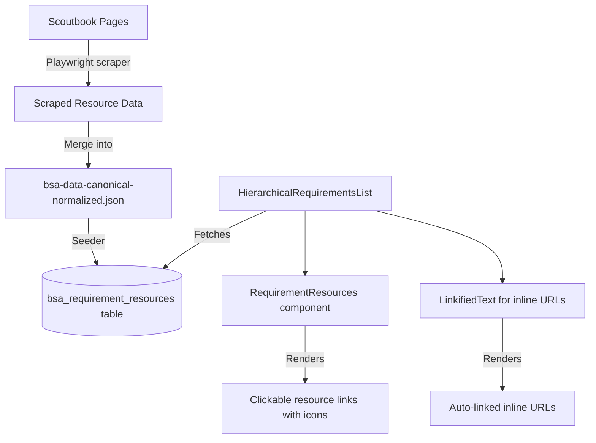

# Requirement Resource Links Implementation Plan

> **Status:** Draft
> **Created:** 2026-02-21
> **Author:** Claude Code

---

## 1. Requirements

### 1.1 Problem Statement

BSA merit badge and rank requirements reference external resources (videos, websites, PDFs) that help scouts and counselors understand and complete requirements. Currently these resource references are embedded as plain text in the `description` field (e.g., `Resources: How to Use a Field Guide (video)`), but the actual URLs were never extracted from the source HTML. Users cannot click through to these resources.

**Scale:** 1,297 of 10,590+ requirements contain `Resources:` / `Resource:` text with named links and types. Additionally, 3 requirements contain inline URLs (geocaching.com, scouting.org).

### 1.2 User Stories

- [ ] As a scout, I want to click on resource links in my requirements so that I can watch instructional videos and visit reference websites
- [ ] As a merit badge counselor, I want to share official BSA resource links with scouts so that they can prepare for requirement sign-offs
- [ ] As a leader, I want requirement resources to be clickable so that I can quickly access reference materials during meetings

### 1.3 Acceptance Criteria

- [ ] Resource URLs are scraped from Scoutbook and stored in structured format in canonical data
- [ ] Resources are stored in a dedicated DB table linked to requirements
- [ ] Resource links render as clickable hyperlinks in the requirement UI (open in new tab)
- [ ] Inline URLs in description text (www.geocaching.com, etc.) auto-link as clickable
- [ ] Resource section is visually distinct from the requirement description text
- [ ] Badge-level pamphlet PDF link is surfaced in the badge detail UI

### 1.4 Out of Scope

- Embedding video players inline (just link out)
- Checking if resource URLs are still valid/live
- User-submitted resource links
- Caching or proxying external resources

### 1.5 Open Questions

| Question | Answer | Decided By |
|----------|--------|------------|
| Re-scrape or inline URL detection first? | Re-scrape to get URLs | User |
| Where to store resource URLs? | New field on canonical data + DB table | User |
| How to render inline URLs? | Auto-detect and hyperlink (new tab) | User |

---

## 2. Technical Design

### 2.1 Approach

**Three-layer approach:**

1. **Data Layer (scrape + store):** Build a Playwright scraper that visits each badge's Scoutbook page, extracts `<a>` tags from requirement resource sections, and stores structured `{name, url, type}` objects. Add a `resources` array to the canonical JSON format and a new `bsa_requirement_resources` DB table.

2. **Seed Layer:** Update the seeder to populate the resources table from canonical data during `npm run db:fresh`.

3. **UI Layer:**
   - Parse resource sections out of description text and render them as clickable links with type icons
   - Auto-detect inline URLs (http://, www.) in description text and render as clickable links
   - Surface pamphlet PDF link on badge detail views

### 2.2 Database Changes

```sql
-- Migration: 20260221000001_add_requirement_resources.sql

-- Resources linked to merit badge requirements
CREATE TABLE bsa_requirement_resources (
  id UUID PRIMARY KEY DEFAULT gen_random_uuid(),
  requirement_id UUID NOT NULL REFERENCES bsa_merit_badge_requirements(id) ON DELETE CASCADE,
  name TEXT NOT NULL,           -- Display name: "How to Use a Field Guide"
  url TEXT NOT NULL,            -- Actual URL: "https://youtube.com/..."
  resource_type TEXT NOT NULL,  -- "video" | "website" | "pdf"
  display_order INTEGER NOT NULL DEFAULT 0,
  created_at TIMESTAMPTZ DEFAULT NOW()
);

CREATE INDEX idx_req_resources_requirement ON bsa_requirement_resources(requirement_id);

-- Resources linked to rank requirements (if any exist)
CREATE TABLE bsa_rank_requirement_resources (
  id UUID PRIMARY KEY DEFAULT gen_random_uuid(),
  requirement_id UUID NOT NULL REFERENCES bsa_rank_requirements(id) ON DELETE CASCADE,
  name TEXT NOT NULL,
  url TEXT NOT NULL,
  resource_type TEXT NOT NULL,
  display_order INTEGER NOT NULL DEFAULT 0,
  created_at TIMESTAMPTZ DEFAULT NOW()
);

CREATE INDEX idx_rank_req_resources_requirement ON bsa_rank_requirement_resources(requirement_id);
```

### 2.3 Canonical Data Format Change

Add `resources` array to requirement objects in `bsa-data-canonical-normalized.json`:

```json
{
  "requirement_number": "4",
  "scoutbook_id": "4",
  "description": "Demonstrate that you know how to use a bird field guide...",
  "is_header": true,
  "display_order": 10,
  "resources": [
    {
      "name": "How to Use a Field Guide",
      "url": "https://www.youtube.com/watch?v=...",
      "type": "video"
    },
    {
      "name": "Merlin Bird ID",
      "url": "https://merlin.allaboutbirds.org/",
      "type": "video"
    }
  ],
  "children": [...]
}
```

The `Resources:` / `Resource:` text should also be **stripped from the description** field once resources are extracted to a structured format, keeping descriptions clean.

### 2.4 UI Components

| Component | Location | Purpose |
|-----------|----------|---------|
| `RequirementResources` | `src/components/advancement/requirement-resources.tsx` | Renders resource links with type icons below requirement text |
| `LinkifiedText` | `src/components/ui/linkified-text.tsx` | Auto-detects URLs in plain text and renders as clickable links |

### 2.5 Architecture Diagram



---

## 3. Implementation Tasks

### Phase 0: Foundation — Data Scraping

#### 0.1 Scraper
- [x] **0.1.1** Build Playwright scraper to extract resource URLs from Scoutbook requirement pages
  - Files: `scripts/scrape-requirement-resources.ts`
  - Details: Visit each badge page on Scoutbook, navigate through all versions, extract `<a>` tags from resource sections, match to requirement numbers, output structured JSON
  - Test: Run scraper on 5 badges, verify URLs are valid

- [x] **0.1.2** Run full scrape across all 141 merit badges and store results
  - Files: `data/requirement-resources-scraped.json`
  - Test: Verify resource count aligns with 1,297 requirements that have `Resources:` text
  - Result: 75 badge versions scraped, 2,266 resource links, 0 errors

#### 0.2 Canonical Data Update
- [x] **0.2.1** Merge scraped resource URLs into canonical normalized JSON
  - Files: `scripts/merge-resource-links.ts`, `data/bsa-data-canonical-normalized.json`
  - Details: Match scraped URLs to requirements by badge+version+requirement_number, add `resources` array, strip `Resources:` text from descriptions
  - Test: Validate canonical JSON still passes `npm run db:validate`

- [x] **0.2.2** Update canonical data stats to track resource counts
  - Files: `data/bsa-data-canonical-normalized.json` (stats section)
  - Test: Stats reflect new resource counts
  - Note: Folded into 0.2.1 — merge script auto-updates stats

### Phase 1: Database & Seeder

#### 1.1 Migration
- [x] **1.1.1** Create migration for `bsa_requirement_resources` and `bsa_rank_requirement_resources` tables
  - Files: `supabase/migrations/20260221000001_add_requirement_resources.sql`
  - Test: `supabase db push` succeeds on dev

#### 1.2 Types & Seeder
- [x] **1.2.1** Update TypeScript database types for new tables
  - Files: `src/types/database.ts`
  - Test: Types compile without errors

- [x] **1.2.2** Update seeder to populate requirement resources from canonical data
  - Files: `scripts/bsa-reference-data.ts`
  - Details: After inserting requirements, insert resource records linked by requirement ID
  - Test: `npm run db:fresh` succeeds, resource count validated

### Phase 2: UI — Resource Links

#### 2.1 Utility Components
- [x] **2.1.1** Create `LinkifiedText` component for auto-detecting inline URLs
  - Files: `src/components/ui/linkified-text.tsx`
  - Details: Regex-detect `http://`, `https://`, `www.` patterns in text, render as `<a target="_blank" rel="noopener noreferrer">`
  - Test: Unit test with various URL patterns

- [ ] **2.1.2** Create `RequirementResources` component for structured resource links
  - Files: `src/components/advancement/requirement-resources.tsx`
  - Details: Render list of resources with type icons (video/website/PDF), each opens in new tab
  - Test: Unit test with mock resource data

#### 2.2 Integration
- [ ] **2.2.1** Update data fetching to include resources when loading requirements
  - Files: Server actions / queries that fetch `bsa_merit_badge_requirements`
  - Details: Join or separate query for resources per requirement
  - Test: Resources appear in fetched data

- [ ] **2.2.2** Integrate `RequirementResources` into `HierarchicalRequirementsList`
  - Files: `src/components/advancement/hierarchical-requirements-list.tsx`
  - Details: Show resources below requirement description when expanded
  - Test: Resources visible in UI for badges that have them

- [ ] **2.2.3** Integrate `LinkifiedText` for all requirement descriptions
  - Files: `src/components/advancement/hierarchical-requirements-list.tsx`, `src/components/advancement/requirement-approval-row.tsx`, `src/components/advancement/merit-badge-detail-sheet.tsx`
  - Details: Replace plain text rendering of descriptions with `LinkifiedText`
  - Test: Geocaching/Cyber Chip inline URLs render as clickable links

- [ ] **2.2.4** Surface pamphlet PDF link in badge detail UI
  - Files: `src/components/advancement/merit-badge-detail-sheet.tsx` or equivalent
  - Details: Add "Official BSA Pamphlet" link using existing `pamphlet_url` from `bsa_merit_badges`
  - Test: Pamphlet link visible on badge detail view

---

<!-- MVP BOUNDARY - Everything above is required for MVP -->

### Phase 3: Enhancements (Post-MVP)

#### 3.1 Polish
- [ ] **3.1.1** Add rank requirement resources (if any exist after scraping)
  - Files: Rank-related components
  - Test: Rank resources render if present

- [ ] **3.1.2** Add resource link analytics (track which resources are clicked)
  - Deferred — evaluate need after MVP launch

---

## 4. Files to Create/Modify

### New Files
| File | Purpose |
|------|---------|
| `scripts/scrape-requirement-resources.ts` | Playwright scraper for resource URLs |
| `scripts/merge-resource-links.ts` | Merge scraped URLs into canonical data |
| `data/requirement-resources-scraped.json` | Raw scraped resource data |
| `supabase/migrations/20260221000001_add_requirement_resources.sql` | DB tables for resources |
| `src/components/ui/linkified-text.tsx` | Auto-link URL detection component |
| `src/components/advancement/requirement-resources.tsx` | Resource links display component |

### Modified Files
| File | Changes |
|------|---------|
| `data/bsa-data-canonical-normalized.json` | Add `resources` arrays, strip `Resources:` from descriptions |
| `scripts/bsa-reference-data.ts` | Seed resource records from canonical data |
| `src/types/database.ts` | Add types for new resource tables |
| `src/components/advancement/hierarchical-requirements-list.tsx` | Integrate resource display + linkified text |
| `src/components/advancement/requirement-approval-row.tsx` | Use LinkifiedText for descriptions |
| `src/components/advancement/merit-badge-detail-sheet.tsx` | Pamphlet link + LinkifiedText + resources |

---

## 5. Testing Strategy

### Unit Tests
- [ ] `LinkifiedText` renders URLs as clickable links
- [ ] `LinkifiedText` handles edge cases (no URLs, multiple URLs, www without protocol)
- [ ] `RequirementResources` renders video/website/PDF links with correct icons
- [ ] Resource data parsing from canonical format

### Integration Tests
- [ ] Requirements with resources display clickable links after seeding
- [ ] Inline URLs in Geocaching/Cyber Chip requirements are clickable

### Manual Testing
- [ ] Navigate to Bird Study merit badge, verify requirement 4 shows video links
- [ ] Navigate to Cybersecurity badge, verify resource links throughout
- [ ] Click resource links, verify they open in new tab
- [ ] Verify pamphlet PDF link on badge detail view

---

## 6. Rollout Plan

### Dependencies
- Scoutbook must be accessible for scraping (may require login/session)
- Playwright must be installed for scraper

### Migration Steps
1. Run scraper to collect resource URLs
2. Merge into canonical data
3. Push DB migration to dev
4. Run `npm run db:fresh` to seed
5. Deploy UI changes
6. Push migration to prod (with approval)

### Verification
- Spot-check 10 badges with known resources (Bird Study, Cybersecurity, Animation, Cycling)
- Verify all resource types (video, website, PDF) render correctly
- Confirm inline URLs auto-link in Geocaching and Cyber Chip requirements

---

## 7. Progress Summary

| Phase | Total | Complete | Status |
|-------|-------|----------|--------|
| Phase 0 | 4 | 4 | Complete |
| Phase 1 | 3 | 3 | Complete |
| Phase 2 | 6 | 0 | Not Started |
| Phase 3 | 2 | 0 | Not Started |

---

## 8. Task Log

| Task | Date | Commit | Notes |
|------|------|--------|-------|
| 0.1.1 | 2026-02-21 | 23a23b4 | Built scraper based on existing scrape-all-merit-badges.ts architecture |
| 0.2.1 | 2026-02-21 | — | Merge script with dry-run support, strips Resources: text, updates stats |
| 0.2.2 | 2026-02-21 | — | Folded into 0.2.1 — merge script auto-updates stats |
| 0.1.2 | 2026-02-21 | d18cb12 | 75 badges scraped (2,266 links), merge applied: 2,429 reqs with 7,931 resource links, 1,501 descriptions cleaned |
| 1.1.1 | 2026-02-21 | 750573c | Migration pushed to dev: bsa_requirement_resources + bsa_rank_requirement_resources tables with RLS |
| 1.2.1 | 2026-02-21 | 2d068dd | Added Row/Insert/Update/Relationships types for both resource tables |
| 1.2.2 | 2026-02-21 | d07a05f | Seeder imports 7,931 resources; wired into db:fresh and standalone CLI |
| 2.1.1 | 2026-02-21 | — | LinkifiedText with 8 unit tests; handles http/https/www, excludes emails |

---

## Approval

- [ ] Requirements reviewed by: _____
- [ ] Technical design reviewed by: _____
- [ ] Ready for implementation
